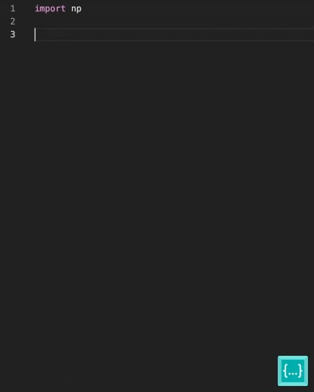

# Codeium Editor

Codeium React Editor is a free, open-source code editor with unlimited autocomplete. Brought to you by the team at [Codeium](https://www.codeium.com/).

## Features
- Unlimited autocomplete (no account required)
- Customizable API extended from [Monaco React](https://github.com/suren-atoyan/monaco-react?tab=readme-ov-file#editor)

## Demo
Check it out [here](https://codeium.com/playground)!

## How it works
This project is a wrapper around Microsoft's Monaco editor which is the editor that powers VS Code with the extended capability of providing code autocompletion. 

The autocompletes are provided by analyzing the editor's content and predicting and providing suggestions based on that context. To learn more about how the autocompletion works, visit [Codeium's FAQ](https://codeium.com/faq).

## API
The core API of the editor is the same as that of the wrapped project. You can view the editor API [here](https://github.com/suren-atoyan/monaco-react?tab=readme-ov-file#editor).

## Acknowledgements
This project would not have been possible without [Suren Atoyan's Monaco React project](https://github.com/suren-atoyan/monaco-react).

## Issues 
Create issues in this repositories for anything related to autocompletion functionality. If you have any issues with the editor API or functionality, create an issue in the [editor repository](https://github.com/suren-atoyan/monaco-react).

## License
[License](https://github.com/Exafunction/codeium-react-editor/blob/main/LICENSE)