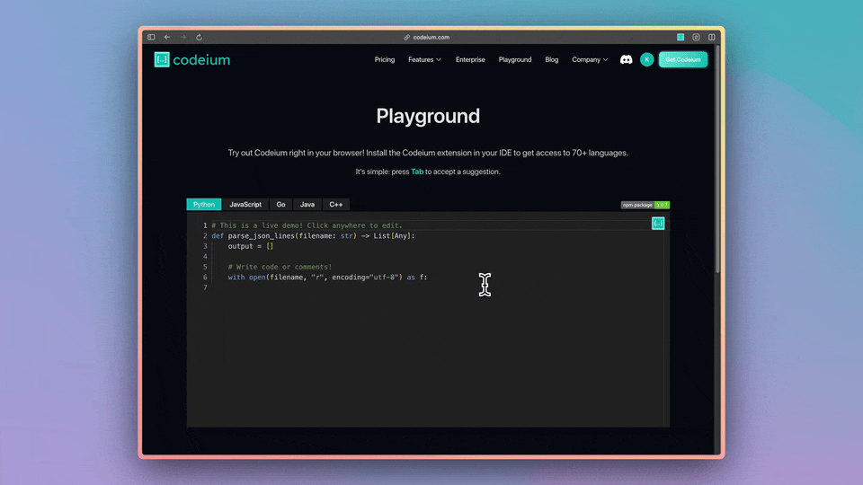

# Codeium Editor

[](https://codeium.com?referrer=github)

[](https://www.npmjs.com/package/@codeium/react-code-editor)

Codeium React Code Editor is a free, open-source code editor as a React component with unlimited AI autocomplete. Brought to you by the team at [Codeium](https://www.codeium.com/). **Free with no account required.**. All you need to do is install our NPM package, add it to your website and you're good to go!



## Features

- Unlimited AI autocomplete (no account required)
- Customizable API extended from [Monaco React](https://github.com/suren-atoyan/monaco-react?tab=readme-ov-file#editor)

## Demo

Check it out [here](https://codeium.com/playground)!

## Getting Started

Install using any of these package manager.s

```sh
# NPM
npm install @codeium/react-code-editor

# Yarn
yarn add @codeium/react-code-editor

# PNPM
pnpm install @codeium/react-code-editor
```

Now import the `CodeiumEditor` and enjoy lightning fast AI autocomplete, directly in your browser, 100% for free!

```tsx
import { CodeiumEditor } from "@codeium/react-code-editor";

export const IdeWithAutocomplete = () => {
  return (
    <div>
      <p>Here's an AI-powered Python editor using Codeium.</p>
      <CodeiumEditor language="python" theme="vs-dark" />
    </div>
  );
};
```

Here's an advanced example that uses multi-document context to provide more intelligent autocompletion:

```tsx
import { CodeiumEditor, Document, Language } from "@codeium/react-code-editor";

export const JavaScriptEditorWithContext = () => {
  const html = `<html>
  <body>
    <h1>Contact Us</h1>
    <form>
      <label>Name:</label>
      <input id="name" type="text" />
      <label>Email:</label>
      <input id="email" type="text" />
    </form>
  </body>
</html>`;

  return (
    <div>
      <p>This editor has context awareness of a neighboring HTML file and can provide better autocompletion suggestions.</p>
      <CodeiumEditor
        language="javascript"
        theme="vs-dark"
        otherDocuments={[
          new Document({
            absolutePath: "/app/index.html",
            relativePath: "index.html",
            text: html,
            editorLanguage: "html",
            language: Language.HTML,
          }),
        ]}
      />
    </div>
  );
};
```

Note that the `otherDocuments` prop has a limit of 10 documents. Within those documents, Codeium will run a reranker behind the scenes to optimize what is included in the token limit.

### Examples

Here are some examples of Codeium React Editor used in production:

- [https://khou22.com/programming/codeium](https://khou22.com/programming/codeium?referrer=github) [[src](https://github.com/khou22/khou22.github.io/blob/b2352449d101f7f9cf8a9382f031091d7dd4cfdd/src/app/programming/codeium/page.tsx#L20)]

## How it works

This project is a wrapper around Microsoft's Monaco editor which is the editor that powers VS Code with the extended capability of providing code autocompletion.

The autocompletes are provided by analyzing the editor's content and predicting and providing suggestions based on that context. To learn more about how the autocompletion works, visit [Codeium's FAQ](https://codeium.com/faq).

## What is Codeium

[Codeium](https://www.codeium.com?referrer=github) is a free, AI-powered developer toolkit that plugs into 70+ IDEs, including: Visual Studio Code, JetBrains IDEs, Google Colab, and Vim. Codeium provides unlimited AI context-aware autocomplete, chat assistant, intelligent search, codebase indexing, and more. Codeium also offers flexible deployments within your VPC or in on-prem, airgapped environments. Learn more at [codeium.com](https://www.codeium.com?referrer=github).

## API

The core API of the editor is the same as that of the wrapped project. You can view the editor API [here](https://github.com/suren-atoyan/monaco-react?tab=readme-ov-file#editor).

## FAQ

#### How can I import the ESM version of this?

To import the ESM version of this, you can use `import { CodeiumEditor } from "@codeium/react-code-editor/dist/esm";`. If you're using TypeScript, your editor might warn that the types are missing. A current workaround is:

- Create a `codeiumeditor.d.ts` file,
- Add `declare module '@codeium/react-code-editor/dist/esm';` to the file
- Import the types file in the file using the `CodeiumEditor` component.

This is an open issue in terms of supporting both CommonJS and ESM. If you're interested in contributing and have a fix for this, pull requests are welcome.

## Acknowledgements

This project would not have been possible without [Suren Atoyan's Monaco React project](https://github.com/suren-atoyan/monaco-react).

## Issues

Create issues in this repositories for anything related to autocompletion functionality. If you have any issues with the editor API or functionality, create an issue in the [editor repository](https://github.com/suren-atoyan/monaco-react).

## License

[License](https://github.com/Exafunction/codeium-react-editor/blob/main/LICENSE)
